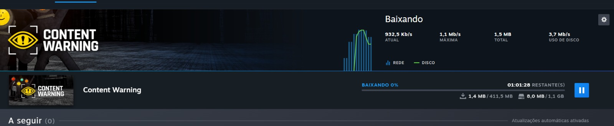
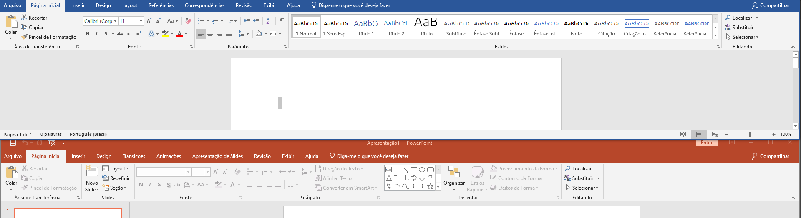
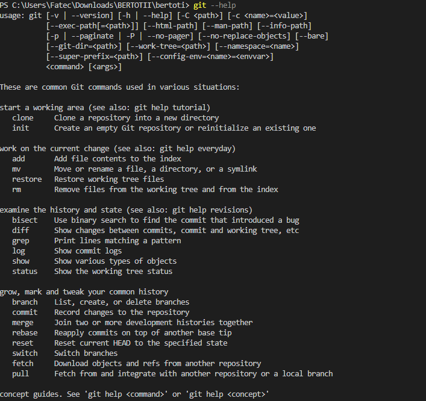
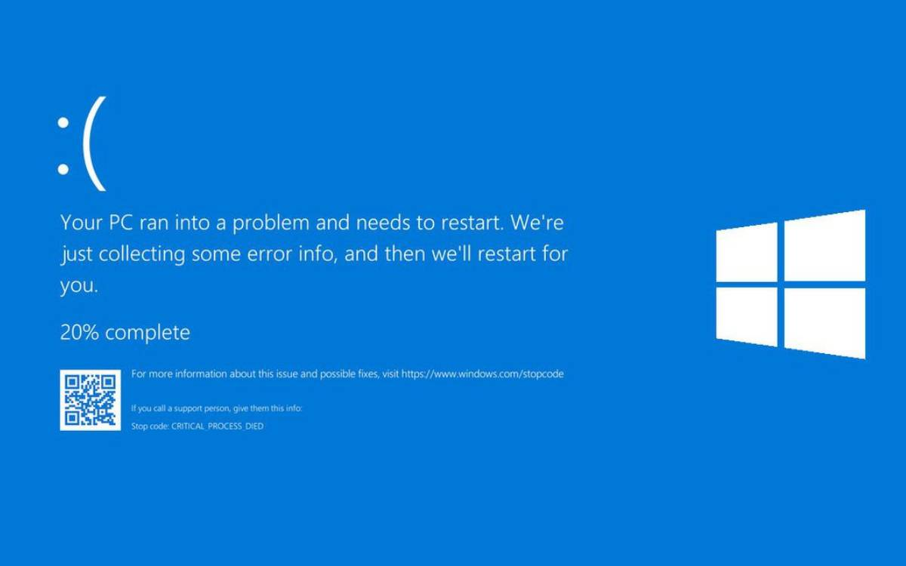

# IHC - Interação Humano Computador - As 10 Heurísticas de Nielsen
### Nome: Gustavo Borges Lima
### Semestre: 3º Desenvolvimento de Software Multiplataforma

### Aqui estão as 10 heurísticas de Nielsen:

 

1. **Visibilidade do status do sistema:** O sistema deve manter os usuários informados sobre o que está acontecendo, fornecendo feedback adequado em tempo hábil. Isso inclui indicadores claros de progresso, tempo de carregamento e status de conclusão de tarefas.

2. **Correspondência entre o sistema e o mundo real:** O sistema deve usar linguagem e conceitos familiares ao usuário, seguindo convenções do mundo real. As informações apresentadas devem ser organizadas de maneira lógica e intuitiva, refletindo o conhecimento prévio do usuário.

3. **Controle e liberdade do usuário:** Os usuários devem ter a liberdade de desfazer ações indesejadas e explorar diferentes opções sem penalidades graves. É importante fornecer botões de "voltar" e "cancelar", além de opções claras para sair de situações indesejadas.

4. **Consistência e padrões:** Elementos de interface, como botões, ícones e menus, devem ser consistentes em todo o sistema. Os padrões de design devem seguir convenções amplamente aceitas para que os usuários possam entender e prever o comportamento do sistema.

5. **Prevenção de erros:** O sistema deve ser projetado para prevenir erros sempre que possível. Isso pode ser alcançado por meio de avisos claros, confirmações de ações perigosas e restrições em recursos que possam levar a erros.

6. **Reconhecimento ao invés de memorização:** É preferível que os usuários reconheçam elementos e opções, em vez de terem que lembrar informações específicas. Os comandos e recursos devem ser visíveis e facilmente acessíveis, reduzindo a carga cognitiva.

7. **Flexibilidade e eficiência de uso:** O sistema deve atender às necessidades de diferentes usuários, permitindo tanto para iniciantes quanto para usuários experientes. É importante oferecer atalhos de teclado, opções personalizáveis ​​e métodos rápidos de execução de tarefas.

8. **Estética e design minimalista:** O design da interface deve ser limpo, esteticamente agradável e livre de informações desnecessárias. Elementos visuais devem ser utilizados para direcionar a atenção do usuário para as informações e ações mais importantes.

9. **Reconhecimento de erros:** Quando ocorrerem erros, o sistema deve fornecer mensagens de erro claras e significativas, indicando o problema de maneira não técnica e sugerindo soluções construtivas para corrigir o erro.

10. **Ajuda e documentação:** Quando necessário, deve haver um suporte claro e acessível para ajudar os usuários a compreenderem o sistema. Isso pode incluir documentação de ajuda, tutoriais, dicas de contexto e mensagens de erro explicativas

# Exemplos de aplicação das heurísticas de Nielsen
| ID Eurística | Imagem | Descrição |
|--|--|--|
| 1 |  | A aba de downlods da STEAM é um exemplo de manter os usuários informados sobre o que está acontecendo, no exemplo da imagem, ao baixar algum jogo, a steam fica constantemente informando ao usuário o progresso de download e o tempo restante para a conclusão da tarefa |
| 4 |  | O sistema do Google Docs é um bom exemplo de consistência e padrões, o sistema utiliza elementos visuais como botões, ícones e menus, que são consistentes em todo o sistema, o sistema também segue convenções amplamente aceitas para que os usuários possam entender e prever o comportamento do sistema |
| 6 |  | Como podemos ver no exemplo com um simples comando todas as opções possiveis são mostradas para se usar o github |
| 6 |  | O sistema do Twitter é um exemplo de reconhecimento ao invés de memorização, o sistema utiliza elementos visuais para direcionar a atenção do usuário para as informações e ações mais importantes, no exemplo da imagem, o sistema utiliza um ícone de balãozinho para o usuário curtir um tweet, ao invés de utilizar um texto como "comentar", o que é um padrão amplamente aceito entre redes sociais |
| 9 |  | O sistema operacional Windows é um exemplo de reconhecimentos de erros, no exemplo da imagem, após ocorrer a famosa "tela azul da morte", o sistema exibe uma mensagem de erro para o usuário, indicando o problema de maneira não técnica e sugerindo soluções construtivas para corrigir o erro |
| 5 |  | Lorem ipsum dolor sit amet, consectetur adipisicing elit, sed do eiusmod tempor incididunt ut labore et dolore magna aliqua. Ut enim ad minim veniam, quis nostrud exercitation ullamco |
| 5 |  | Lorem ipsum dolor sit amet, consectetur adipisicing elit, sed do eiusmod tempor incididunt ut labore et dolore magna aliqua. Ut enim ad minim veniam, quis nostrud exercitation ullamco |
| 5 |  | Lorem ipsum dolor sit amet, consectetur adipisicing elit, sed do eiusmod tempor incididunt ut labore et dolore magna aliqua. Ut enim ad minim veniam, quis nostrud exercitation ullamco |
| 6 |  | Lorem ipsum dolor sit amet, consectetur adipisicing elit, sed do eiusmod tempor incididunt ut labore et dolore magna aliqua. Ut enim ad minim veniam, quis nostrud exercitation ullamco |
| 7 |  | Lorem ipsum dolor sit amet, consectetur adipisicing elit, sed do eiusmod tempor incididunt ut labore et dolore magna aliqua. Ut enim ad minim veniam, quis nostrud exercitation ullamco |
| 8 |  | Lorem ipsum dolor sit amet, consectetur adipisicing elit, sed do eiusmod tempor incididunt ut labore et dolore magna aliqua. Ut enim ad minim veniam, quis nostrud exercitation ullamco |
| 8 |  |Lorem ipsum dolor sit amet, consectetur adipisicing elit, sed do eiusmod tempor incididunt ut labore et dolore magna aliqua. Ut enim ad minim veniam, quis nostrud exercitation ullamco |
| 8 |  | Lorem ipsum dolor sit amet, consectetur adipisicing elit, sed do eiusmod tempor incididunt ut labore et dolore magna aliqua. Ut enim ad minim veniam, quis nostrud exercitation ullamco |
| 8 |  | Lorem ipsum dolor sit amet, consectetur adipisicing elit, sed do eiusmod tempor incididunt ut labore et dolore magna aliqua. Ut enim ad minim veniam, quis nostrud exercitation ullamco |
| 9 |  | Lorem ipsum dolor sit amet, consectetur adipisicing elit, sed do eiusmod tempor incididunt ut labore et dolore magna aliqua. Ut enim ad minim veniam, quis nostrud exercitation ullamco |
| 9 |  | Lorem ipsum dolor sit amet, consectetur adipisicing elit, sed do eiusmod tempor incididunt ut labore et dolore magna aliqua. Ut enim ad minim veniam, quis nostrud exercitation ullamco |
| 10 |  | Lorem ipsum dolor sit amet, consectetur adipisicing elit, sed do eiusmod tempor incididunt ut labore et dolore magna aliqua. Ut enim ad minim veniam, quis nostrud exercitation ullamco |
| 10 |  | Lorem ipsum dolor sit amet, consectetur adipisicing elit, sed do eiusmod tempor incididunt ut labore et dolore magna aliqua. Ut enim ad minim veniam, quis nostrud exercitation ullamco |
